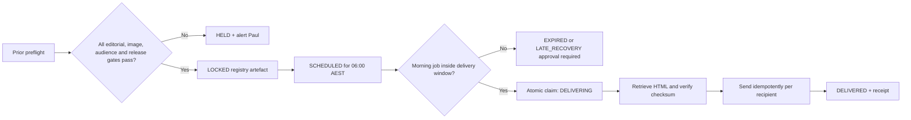

# DTL Signal Durable Release Registry

**Status:** Architecture deployed; production schema verified; Edition 0048 proof approved; production scheduling remains contained
**Decision:** Option B selected by Paul Ford
**Author:** Manus AI
**Subscriber state:** Dry-run containment

## Purpose

The release registry makes the **edition**, rather than the Render command or an email receipt, the source of truth. It separates content preparation from delivery and makes the morning job deterministic.

> The 06:00 AEST job may deliver one already-locked, date-matched edition. It may not fetch sources, call an editorial model, change a source, select an image, rebuild HTML or reinterpret a release manifest.

## Proposed infrastructure

Use a dedicated **Render Postgres** database named `dtl-signal-registry` in the Singapore region. A read-only review of the current Render project shows one resource—the `dtl-signal` cron service—and no database or persistent key-value store to reuse.

Render provides an internal database URL for services in the same account and region. Using that URL keeps the cron-to-database connection on Render’s private network.[1] Paid Render Postgres instances provide point-in-time recovery and logical exports; the available recovery window depends on the workspace plan.[2]

The approved initial plan is **Basic-256mb** at **US$6 per month** plus the minimum 1 GB storage at **US$0.30 per month**, for an actual live-form total of **US$6.30 per month**. The free database is unsuitable because it has a 30-day limit and does not provide the paid-plan logical backup capability.[2] [6] The release registry’s expected volume is small—one release row and approximately one recipient row per active subscriber per edition—so no larger compute plan is justified initially.

Render created service `dpg-daeupc8u01pc738492kg-a`, named `dtl-signal-registry`, in the current project’s Production environment and Singapore region, with PostgreSQL 18, plan `0.1c-256mb`, **1 GB storage**, storage autoscaling disabled and high availability disabled. A fresh service read reports status `available`. The contained Signal service has the managed internal connection under masked key `SIGNAL_REGISTRY_DATABASE_URL`. Deployed commit `78f4ff2bf6595d47374a050bba6e6ccea0d887f5` applied migration `001_release_registry` successfully on 7 September 2026 with source checksum `38b4fe9ce630a3b48613b90b746036e8b9f3c59b2a2a6d89a3100bc78e263eab`. The migration runner verified four tables, three guard functions, three triggers, two operational indexes and thirteen named constraints before exiting successfully. No release or audience data was inserted.

The initial default database credential was rotated after Render's dashboard automation unexpectedly surfaced it. Replacement default username `signal_registry_v2` was created with zero open connections, and the original `signal_registry` credential was permanently deleted before any application link, schema or registry data existed. A later managed-reference attempt unexpectedly rendered the replacement connection string before save, so that unsaved edit was cancelled, default credential `signal_registry_v3` was created, and `signal_registry_v2` was permanently deleted with zero open connections before any application or schema use. Only `signal_registry_v3` remains. No secret value was written to source, logs or local files.

The registry stores HTML as text, not as a local file. The REMEMBER THE WORLD image remains in durable object storage; the registry stores its approved identity, URL, source, creator, licence and checksum. This removes any dependency on Render’s ephemeral filesystem.

## Data model

### `signal_releases`

| Field | Type | Integrity rule |
|---|---|---|
| `id` | UUID | Application-generated immutable identifier |
| `edition_number` | Integer | Positive; unique with edition type because Saturday retains Friday’s number |
| `issue_date` | Date | Unique with edition type |
| `edition_type` | Text | `daily` or `weekly_wrap` |
| `release_scope` | Text | `proof` or `production`; permits an isolated canary and subscriber release for the same edition |
| `state` | Text | Guarded state machine below |
| `editorial_revision` | Text | Versioned policy identifier |
| `renderer` | Text | Exact renderer contract |
| `release_id` | Text | Versioned release contract |
| `git_commit` | Character(40) | Exact deployed source identity |
| `subject` | Text | Locked before delivery |
| `html_body` | Text | Immutable after `LOCKED` |
| `html_sha256` | Character(64) | Verified on every retrieval |
| `image_id` | Text | Mandatory for v4 daily editions |
| `image_sha256` | Character(64) | Stable prepared-image identity |
| `audience_sha256` | Character(64) | Hash of sorted eligible recipient identities |
| `audience_count` | Integer | Must equal recipient-row count |
| `metadata` | JSONB | Immutable source URLs, joke ID, memory update and release diagnostics needed after delivery |
| `scheduled_for` | Timestamp with timezone | Intended delivery time |
| `window_start` / `window_end` | Timestamp with timezone | Only permitted delivery interval |
| `locked_at` / `delivered_at` | Timestamp with timezone | Audit timestamps |
| `created_at` / `updated_at` | Timestamp with timezone | Registry timestamps |

The database has unique constraints on `(edition_number, edition_type, release_scope)` and `(issue_date, edition_type, release_scope)`. This preserves the existing calendar rule in which Saturday’s Weekly Wrap retains Friday’s edition number while allowing one one-recipient proof and one production audience for the same edition. Once a release enters `LOCKED`, a database trigger rejects changes to content identity, subject, HTML, checksums, image, audience and delivery window.

### `signal_release_recipients`

| Field | Type | Integrity rule |
|---|---|---|
| `release_id` | UUID | Foreign key to `signal_releases` |
| `subscriber_id` | Big integer | Frozen DTL PL identity from the source-of-truth audience response |
| `recipient_email` | Text | Frozen audience destination |
| `recipient_hash` | Character(64) | Normalised-email SHA-256 |
| `first_name` | Text | Optional frozen personalisation |
| `unsubscribe_token` | Text | Frozen token used for deterministic final HTML |
| `recipient_html_body` | Text | Exact final recipient HTML; immutable once the release is locked |
| `recipient_html_sha256` | Character(64) | Verifies recipient-specific unsubscribe rendering |
| `delivery_state` | Text | `PENDING`, `SENDING`, `SENT`, `DELIVERED`, `BOUNCED`, `FAILED` |
| `idempotency_key` | Text | Unique permanent Signal identity |
| `provider_message_id` | Text | Unique when Resend accepts the message |
| `attempt_count` | Integer | Monotonic |
| `last_error` | Text | Sanitised; no credentials |
| `sent_at` / `delivered_at` | Timestamp with timezone | Provider lifecycle |

A unique constraint on `(release_id, recipient_hash)` prevents a duplicate audience row. A second unique constraint on `idempotency_key` prevents a second logical send from being created by application retries or manual triggers. The key includes edition number, edition type, release scope and recipient hash, so a proof cannot block the separately approved production release. Resend idempotency remains a second line of defence, but Resend retains provider keys for 24 hours, so the registry is the permanent control.[3]

### `signal_release_events`

This append-only table records release transitions, recipient send claims, confirmed provider acceptance and definitive provider rejection. PostgreSQL rejects any event update or deletion. The schema reserves a unique event key for future idempotent webhook ingestion, but webhook processing is not part of the current activation scope and must not be represented as live.

## Release state machine

| State | Meaning | Permitted next states |
|---|---|---|
| `PREPARING` | Source, plan, image and audience assembly in progress | `HELD`, `LOCKED` |
| `HELD` | A mandatory preflight check failed | `PREPARING`, `EXPIRED` |
| `LOCKED` | Complete immutable edition and audience passed all gates | `SCHEDULED`, `EXPIRED` |
| `SCHEDULED` | Delivery time and recipient rows committed | `DELIVERING`, `EXPIRED` |
| `DELIVERING` | Morning worker owns the release transaction | `DELIVERED`, `FAILED`, `LATE_RECOVERY` |
| `DELIVERED` | Every recipient call accepted; provider verification remains separate | Terminal |
| `LATE_RECOVERY` | Delivery occurred outside the approved window | Terminal |
| `FAILED` | Delivery began but the complete audience was not accepted | Terminal; a new explicit recovery release is required |
| `EXPIRED` | Delivery window passed without eligible execution | Terminal |

State changes use a row lock and a compare-and-set update. A manual trigger racing the scheduled job can acquire only one `SCHEDULED` release; the other process exits without sending.

The delivery claim carries a 30-minute database lease. A competing trigger during that lease is a no-op. If the worker crashes, a later worker may reclaim the `DELIVERING` release only after the lease expires; any recipient left in `SENDING` is retried with the same permanent registry and Resend idempotency key. This closes the crash-after-provider-acceptance gap without permitting concurrent send loops.

An uncertain `SENDING` recipient may be retried only while the provider idempotency key is safely inside a 23-hour boundary. After that point the release fails closed for manual reconciliation rather than risk a duplicate after Resend’s 24-hour idempotency window expires.

The provider boundary requires a real Resend message ID. A transport exception or missing ID is treated as uncertain rather than failed: the database retains `DELIVERING` / `SENDING` and retries only after the lease with the same key. Recipient-state transitions are also guarded in PostgreSQL, preventing a terminal row from being reset to `PENDING` or resent. DTL PL attribution occurs only after registry delivery is complete; an attribution outage is recorded as a warning and cannot rewrite a confirmed provider delivery as failed.

## Two-stage operation

The preflight performs all existing source, scoring, planner, reader-copy, image, release-identity, recipient-integrity and HTML checks. It writes the release and recipient snapshot in one transaction only after every gate passes. Failure produces `HELD` and no `SCHEDULED` record.

The morning command reads only the release for the current Brisbane issue date. It verifies state, commit, renderer, checksums, image identity, audience count and delivery window. It never calls the source fetcher, scorer, editorial model or image selector.

## Failure behaviour

| Failure | Required response |
|---|---|
| Registry unavailable | Exit non-zero; send no email; alert through the independent operations channel |
| No date-matched `SCHEDULED` release | Exit non-zero; no generation fallback |
| HTML or image checksum mismatch | Transition to `FAILED`; send nothing |
| Audience checksum or count mismatch | Transition to `FAILED`; send nothing |
| Duplicate scheduled/manual execution | Only one process can claim; the duplicate sends nothing and exits non-zero because no claimable release remains |
| Provider rate limit | Retry with bounded backoff and the same idempotency key |
| Crash after provider acceptance | Retry resolves through registry row plus Resend idempotency; never create a new logical recipient send |
| Run outside the delivery window | Do not send automatically; require explicit `LATE_RECOVERY` approval |

## Migration and rollback

The migration is additive. The existing direct-send code remains present but the production command stays in dry-run containment. New tables are created without modifying subscriber data or historical release artefacts.

Rollback means setting both registry commands to dry-run and leaving subscriber delivery disabled. A registry failure never falls back to the old direct-send path. Database rollback uses point-in-time recovery or a logical export on a paid Render Postgres plan; a recovered instance is validated separately before reconnecting the cron service.[2]

## Deployment shape

| Component | Command | Subscriber effect |
|---|---|---|
| Preflight cron | `python -m src.main --prepare-release --release-scope production --next-issue-date --enhanced --alive-moment --force-type daily` | Targets the next Brisbane date without shell interpolation; never sends subscriber email; requires `SIGNAL_PRODUCTION_PREFLIGHT_ENABLED=1` |
| Delivery cron | `python -m src.main --deliver-release --release-scope production --force-type daily` | Claims only the current Brisbane date’s `SCHEDULED` registry artefact; requires `SIGNAL_PRODUCTION_DELIVERY_ENABLED=1` |
| Existing direct path | `python -m src.main --dry-run ...` | Contained during migration; not a production fallback |

Both production cron definitions are source-controlled on an annual disabled schedule with their activation switches set to `0`. They cannot be enabled merely by deploying code. When Fordy separately approves subscriber reactivation, the prior-evening preflight schedule and 06:00 AEST delivery schedule must be activated deliberately, on the same exact deployed commit, after their service identities and managed database links are verified. Both jobs connect to Postgres through the same-region internal URL. Render cron jobs can initiate private-network connections to Render Postgres but cannot receive inbound private-network traffic.[5]

### Scheduling service options

| Approach | Trade-offs | Cost | Setup complexity |
|---|---|---|---|
| Reuse the existing cron as the morning delivery worker and add one dedicated prior-evening preflight cron | Preserves the audited two-stage design, keeps logs and failure alerts separate, and requires no new orchestration runtime. It adds one Render service. | Render bills active cron runtime by the second and applies a **US$1 minimum monthly charge per cron service**.[7] Reusing the current service means one additional service, so the incremental floor is US$1/month plus runtime. | Low |
| Replace both jobs with a single Render Workflow that chains preflight and delayed delivery | Can place multiple tasks in one workflow service and uses Flex metering, but introduces a new orchestration layer and requires reworking the already-audited cron operating model. | Flex is metered by actual CPU and RAM; task-state retention is US$0.25/GB-month.[8] | Medium-high |

Fordy approved the dedicated-preflight option on 7 September 2026. Render cron `dtl-signal-preflight` (`crn-daf2vgn40ujc739biup0`) was created in the Production environment and Singapore region on minimum compute with annual containment schedule `0 0 1 1 *` and production preflight activation disabled. Its first build exposed a test-isolation defect only: two legacy delivery simulations inherited the service-level registry-required setting and failed before deployment. The fixture was isolated without changing runtime code, complete Render-style 179-test gates passed in the integration and detached checkouts, all four real PostgreSQL tests passed separately in both, and commit `c402f7ecbee6c11cd6f522e7070659f8bd8758a6` deployed successfully as build `bld-daf33k9t0dsc73cbmcb0` with 179 tests passed and four production-only skips. A masked four-key environment group supplies the required API and database credentials without exposing values; service-specific identity and activation settings remain direct overrides. A manual containment run logged `REGISTRY PRODUCTION PREFLIGHT DISABLED` and exited before source fetch, subscriber fetch or registry write. The existing delivery service was aligned to the same exact commit and separately proved `REGISTRY PRODUCTION DELIVERY DISABLED` before any registry claim or provider contact. Both services remain contained.

No production schedule or subscriber delivery is activated by this service creation. The existing `dtl-signal` cron remains the contained future delivery worker; the new preflight cron is a separately deployed but disabled preparation stage. The workflow alternative remains available if reducing the number of services later becomes more important than minimising release-path change.

## Acceptance boundary

No subscriber reactivation occurs until the registry passes source-scarcity, missing-image, checksum-corruption, audience-drift, duplicate-trigger, crash-after-provider-acceptance, late-run and database-unavailable simulations. The one-recipient canary is the proof-scope registry release for the same immutable base HTML; production scope is never partially claimed because doing so would leave the remaining frozen audience resumable.

Edition 0048 proof release `16d582f1-3009-4e09-9197-5ca40d1bf343` completed at 1/1 with exact HTML checksum `e77af51c5fe7ef1ab1fdd0d2cd571e0b261a2bf6914bc3e8d333e1dd57d2045f`. Resend independently reported the provider record as `opened`; Gmail independently contained the full approved reader copy and the governed Gary steel-plant image before the final Dad Joke. Fordy approved that exact canary. This establishes proof-scope `CANARY VERIFIED`; it does not establish `LIVE` or `SUBSCRIBER VERIFIED`.

The current readiness gate comprises **182 tests across 16 independently bounded modules** in both the integration checkout and a fresh detached worktree, with the four production-only database tests skipped in each general run and then executed successfully against checksum-migrated isolated PostgreSQL databases in both checkouts. Edition 0049 has a date-resolved, public-domain NASA Great Barrier Reef record with hosted bytes locked to SHA-256 `1b49747f4a2c72a4673c158bef5710c116928dee3ed7e9ba72f552ffc5d41727`. Registry preflight now requires the hosted HTTPS asset, image content type and exact byte checksum before freezing; delivery uses the immutable record and performs no image fetch. These are build and proof-readiness facts only; scheduled-time subscriber evidence still requires a new future edition and a separate activation decision.

## References

[1]: https://render.com/docs/postgresql-creating-connecting "Render — Create and Connect to Render Postgres"
[2]: https://render.com/docs/postgresql-backups "Render — Postgres Recovery and Backups"
[3]: https://resend.com/docs/dashboard/emails/idempotency-keys "Resend — Idempotency Keys"
[4]: https://resend.com/docs/webhooks/introduction "Resend — Managing Webhooks"
[5]: https://render.com/docs/private-network "Render — Private Network"
[6]: https://render.com/pricing "Render — Pricing"
[7]: https://render.com/docs/cronjobs "Render — Cron Jobs"
[8]: https://render.com/docs/workflows-limits "Render — Workflow Limits and Pricing"
